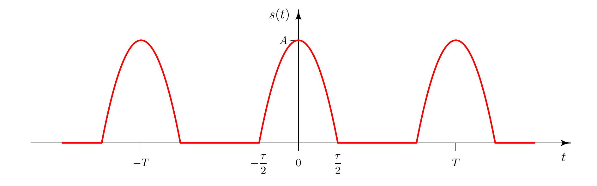

```{css css-format, echo=FALSE}
.header-section-number { display: none; }
body { counter-reset: counter-level-1; }
h1:not(.title) {
  counter-increment: counter-level-1;
  counter-reset: counter-level-2;
}
h1:not(.title)::before{ content: "Aufgabe " counter(counter-level-1) ": "; }
h2 {
  counter-increment: counter-level-2;
  counter-reset: counter-level-3;
}
h2::before { content: counter(counter-level-1) "." counter(counter-level-2) " "; }
```

```{cat abb-tab-eq, engine.opts = list(file = "_bookdown.yml")}
language:
  label:
    fig: 'Abbildung '
    tab: 'Tabelle '
    eq: 'Gleichung '
```

```{r Initialisierung, include=FALSE, message=FALSE, warning=FALSE}
rm(list=ls()) # Loeschen aller Variablen und Funktionen

# Im Folgenden werden notwendige Pakete geladen:
library("rmarkdown")
library("bookdown")
library("knitr")
library("plotrix") # Um Achsen zu «brechen»

opts_knit$set(child.path='Uebung01/')

```

# Periodische Funktion {-}
Gegeben ist die folgende periodische Funktion:

```{r  label = e01a01f01, echo = F, fig.cap = "Darstellung der periodischen Funktion $s(t)$.", out.width = '100%'}

```

Die Funktion, die in Abbildung \@ref(fig:e01a01f01) dargestellt ist, ist im Bereich $\left[-\frac T2,\frac T2\right]$ definiert als
```{=tex}
\begin{align}
  s(t)&=\begin{cases}
    0 & \text{$\left[-\frac T2,-\frac\tau2\right]$ und $\left[\frac\tau2,\frac T2\right]$} \\
    A\left(1-\frac{4t^2}{\tau^2}\right) & \text{$\left[-\frac\tau2,\frac\tau2\right]$}
  \end{cases} (\#eq:function)
\end{align}
```
mit periodischer Wiederholung.

## {-}
Programmieren Sie in R eine Funktion, die den Verlauf der der Gleichung \@ref(eq:function) beschreibt und stellen Sie diese für $T=1\,\mathrm{s}$, $\tau=0.5\,\mathrm{s}$ und $A=1$ im Bereich von $t=-1.5T$ bis $1.5T$ graphisch dar.

```{r}

```

## {-}
Berechnen Sie die reellen Fourierkoeffizienten $a_n$ und $b_n$ der Funktion $s(t)$ in analytischer Form (nicht in R) sowie numerisch für die Koeffizienten bis $n=10$.

```{r}

```

## {-}
Beschreiben Sie die beiden Ausdrücke «kontinuierliches Spektrum» und «diskretes Spektrum». Wann erwarten Sie ein kontinuierliches, wann ein diskretes Spektrum?


## {-}
Stellen Sie $\frac{a_n}{a_0}$ für $\frac{\tau}{T}=\frac{1}{4}$ und $\frac{\tau}{T}=\frac{1}{8}$ graphisch dar. Handelt es sich hier um ein kontinuierliches oder um ein diskretes Spektrum?

```{r}

```

## {-}
Stellen Sie die Summen (i) der ersten zehn bzw. (ii) der ersten zwanzig Terme der Fourierreihe der Funktion $s(t)$ graphisch dar. 

Erwarten Sie bei der Rekonstruktion von $s(t)$ aus den Harmonischen ein Gibbsphänomen? Wenn ja, wo?

```{r}

```
