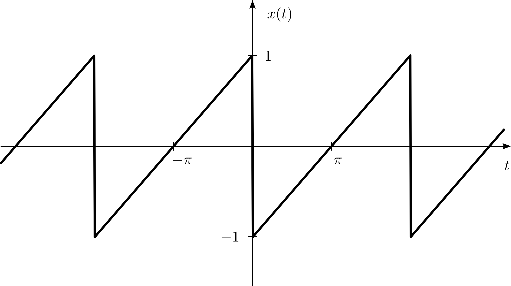

```{css css-format, echo=FALSE}
.header-section-number { display: none; }
body { counter-reset: counter-level-1; }
h1:not(.title) {
  counter-increment: counter-level-1;
  counter-reset: counter-level-2;
}
h1:not(.title)::before{ content: "Aufgabe " counter(counter-level-1) ": "; }
h2 {
  counter-increment: counter-level-2;
  counter-reset: counter-level-3;
}
h2::before { content: counter(counter-level-1) "." counter(counter-level-2) " "; }
```

```{cat abb-tab-eq, engine.opts = list(file = "_bookdown.yml")}
language:
  label:
    fig: 'Abbildung '
    tab: 'Tabelle '
    eq: 'Gleichung '
```

```{r Initialisierung, include=F, message=F, warning=F}
rm(list=ls()) # Loeschen aller Variablen und Funktionen

# Im Folgenden werden notwendige Pakete geladen:
library("rmarkdown")
library("bookdown")
library("knitr")
library("plotrix") # Um Achsen zu «brechen»
library("shape")

```

# Fourier-Analyse, Gibbs-Phänomen {#Aufg0}

Die in Abbildung \@ref(fig:e03a01f01) dargestellte Sägezahnfunktion $x(t)$ soll durch die Fourier-Reihe
\begin{align}
  x(t)&=\frac{2}{\pi}\sum\limits_{m=1}^{\infty}-\frac{1}{m}\,\sin(mt) (\#eq:sz)
\end{align}
beschrieben werden.

```{r  label = e03a01f01, echo = F, fig.cap = "Sägezahnfunktion $x(t)$.", out.width = '80%', fig.align='center'}

```

Erzeugen Sie näherungsweise $x(t)$ im Bereich $-3\pi < t < 3\pi$ mit 3, 9, 15 und 55 Termen mit jeweils 8000 Punkten auf der Zeitachse.

Kommentieren Sie die Anpassungen und äussern Sie sich zum Gibbs-Phänomen!

# Diskrete Fouriertransformation {#Aufg1}
Anhand eines Beispiels aus der NMR-Spektroskopie sollen einige Eigenschaften der diskreten Fourier-Transformation kennengelernt werden.

Die Energie $\Delta E$ und die entsprechende Frequenz $f$ für die Protonenresonanz sind proportional zum Magnetfeld $B_0$
\begin{align}
  \Delta E=hf=\frac{h}{2\pi}\gamma(1-\sigma)B_0.
\end{align}
$\gamma$ ist das gyromagnetische Verhältnis, das für Protonen $2.675\,221\,8744(11)\times10^{8}\,\mathrm{rad\,s^{-1}\,T^{-1}}$ beträgt. Die Grösse $\sigma$ heisst chemische Verschiebung.

In der Kernresonanz betrachtet man das ganze Experiment im sogenannten «rotierenden Koordinatensystem», einem mit der Radiofrequenz $f_0$ mitrotierenden System. Für die Messtechnik hat dies zur Folge, dass der das Spinsystem anregende Radiofrequenzpuls (Frequenz $f_0$) durch die umhüllende Rechteckfunktion beschrieben werden kann. Zudem detektiert man so direkt die durch die chemische Verschiebung bewirkte Offsetfrequenz $f_{\sigma}$,
\begin{align}
  f_{\sigma} = \sigma f_0 = f_0 - f 
\end{align}
und nicht die Resonanzfrequenz $f$ (die um ca. 6 Grössenordnungen höher ist).

## {#A1a}
Welche Stärke muss der NMR-Magnet aufweisen, wenn das Signal von Tetramethylsilan (TMS, $\sigma \equiv 0$) bei $f_0=200\,\mathrm{MHz}$ beobachtet werden soll? Berechnen Sie die Offsetfrequenz, die einer chemischen Verschiebung von $1\,\mathrm{ppm}$ entspricht.

Die Datei `fid1.dat` enthält den digitalisierten $^1$H-FID (free induction decay) von Ethylbromid $\mathrm{CH_3CH_2Br}$, d.h. die Antwort $s(t_i)$, $i = 1...N$, des Spinsystems auf einen kurzen Anregungspuls. Der FID wurde mit einem Abtastintervall von $250\,\mu\mathrm{s}$ über $N = 4096$ Datenpunkte gemessen. Durch Fourier-Transformation des FIDs erhält man das $^1$H-NMR-Frequenzspektrum $S(f_i)$.

## {#A1b}
Lesen Sie die Daten des FID ein und stellen Sie die Funktion dar. Welches bekannte Phänomen können Sie erkennen und was lässt sich damit bereits (grob) bestimmen?

## {#A1c}
Bestimmen Sie die Nyquist-Frequenz $f_{\mathrm N}$ (in Hz) und $\sigma_{\mathrm N}$ (in ppm) für die Messdaten. Wie gross ist der Frequenzabstand $\Delta f=|f_{i+1}-f_{i}|$ aufeinanderfolgender Datenpunkte? Welche Bedeutung haben $f_{\mathrm N}$ und $\Delta f$?

## {#A1d}
Berechnen Sie das $^1$H-NMR-Spektrum $S(\sigma_i)$ von Ethylbromid mittels Fourier-Transformation $\mathcal{F}\{s(t_i)\}$ und anschliessende Skalierung. Stellen Sie in dieser und den folgenden Aufgaben jeweils den Realteil des Spektrums dar und beschreiben Sie die nach der Datenmanipulation beobachteten Effekte. Wählen Sie einen Bereich von $0\,\mathrm{ppm}$ bis $10\,\mathrm{ppm}$ für die chemische Verschiebung.

Zeichnen Sie auch die Integrationskurve als Mass für die Intensität der NMR-Übergänge und damit der Zahl der absorbierenden $^1$H-Kerne in der gewohnten Art in das Spektrum ein.


Die nachfolgenden Aufgaben behandeln einige in der diskreten Fouriertransformation gebräuchliche Datenmanipulationen.

## {#A1e}
*Undersampling*: Vergrössern Sie das Abtastintervall des FIDs künstlich um den Faktor $k=2$, $3$, $4$ und $5$. Geben Sie die resultierenden Nyquist-Frequenzen an und diskutieren Sie die Auswirkungen auf das Spektrum. Zeichnen Sie nur den Bereich zwischen $0\,\mathrm{ppm}$ und $5\,\mathrm{ppm}$.

## {#A1f}
*Truncated FID*: Verwenden Sie in dieser Aufgabe nur die ersten $N = 512$ Messpunkte des Originaldatensatzes. Der FID ist, wie man anhand der in Aufgabe \@ref(A1b) dargestellten Daten verifizieren kann, innerhalb dieser Messzeit noch nicht vollständig relaxiert. Welcher Effekt resultiert im Spektrum aus der Transformation des verkürzten Datensatzes?

## {#A1g}
*Matched Filter*: Multiplizieren Sie den in der vorhergehenden Aufgabe erzeugten verkürzten FID mit der exponentiell abfallenden Funktion
\begin{align}
  a_1(t) = \exp\left\{-\frac{t}{\tau}\right\}. (\#eq:apod)
\end{align}
Variieren Sie $\tau$, diskutieren Sie die Auswirkungen auf das Spektrum und gewinnen Sie aus den Darstellungen einen qualitativen Zusammenhang mit der Breite der NMR-Linien.

## {#A1h}
*Zero Filling*: Verlängern Sie den auf $N = 512$ Messpunkte verkürzten und nach Gleichung \@ref(eq:apod) mit $\tau=0.025\,\mathrm{s}$ apodisierten FID durch Anhängen von Nullen auf (a) 1024, (b) 2048 und (c) 4096 Punkte. Was ergibt sich in den Spektren?

Welcher Effekt resultiert, wenn der nicht relaxierte FID mit Nullen verlängert wird?

## {#A1i}
*Computer Sharpening*: Die Lorentz-Gauss-Transformation, d.h. die Multiplikation des FIDs mit der Funktion
\begin{align}
  a_2(t) = \exp\left\{\frac{t}{\tau}\right\} \exp\left\{-bt^2\right\},
\end{align}
ist unter dem Stichwort «computer sharpening» bekannt. Wählen Sie für den in Aufgabe \@ref(A1h)(c) mit $\tau = 0.1\,\mathrm{s}$ erzeugten FID den Parameter $b$ so, dass der suggerierte Effekt resultiert.

