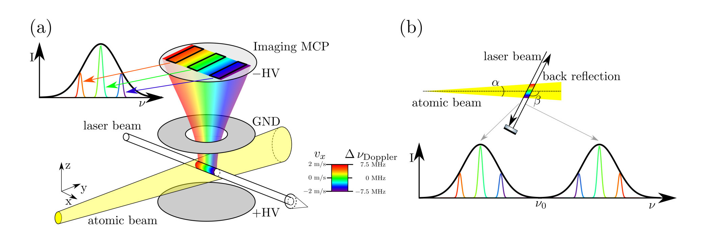
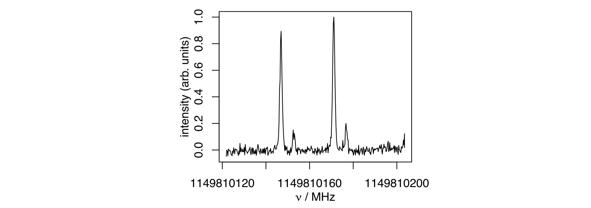
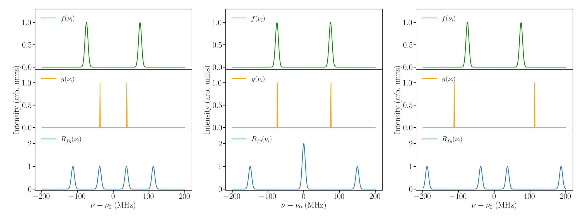

```{css css-format, echo=FALSE}
.header-section-number { display: none; }
body { counter-reset: counter-level-1; }
h1:not(.title) {
  counter-increment: counter-level-1;
  counter-reset: counter-level-2;
}
h1:not(.title)::before{ content: "Aufgabe " counter(counter-level-1) ": "; }
h2 {
  counter-increment: counter-level-2;
  counter-reset: counter-level-3;
}
h2::before { content: counter(counter-level-1) "." counter(counter-level-2) " "; }
```

```{cat abb-tab-eq, engine.opts = list(file = "_bookdown.yml")}
language:
  label:
    fig: 'Abbildung '
    tab: 'Tabelle '
    eq: 'Gleichung '
```

```{r Initialisierung, include=F, message=F, warning=F}
rm(list=ls()) # Loeschen aller Variablen und Funktionen

# Im Folgenden werden notwendige Pakete geladen:
library("rmarkdown")
library("bookdown")
library("knitr")
library("plotrix") # Um Achsen zu «brechen»
library("shape")

```

In dieser Übung lernen Sie im Kontext der Doppler-freien Spektroskopie ein Anwendung der Autokorrelation und der Kreuzkorrelation kennen. 

# {#Aufg1}

Der Doppler-Effekt führt zu einer Verschiebung der wahrgenommenen Laserfrequenz bei der Anregung von Atomen und Molekülen um
\begin{align}
\Delta \nu_\mathrm{D}=\frac{1}{2 \pi}\vec{k}_\mathrm{Laser}\cdot\vec{v}=\frac{v}{c}\nu_\mathrm{Laser}\cos \beta, (\#eq:dnu)
\end{align}
wobei $\vec{k}$ den Wellenzahlvektor des Lasers mit Frequenz $\nu_\mathrm{Laser}$ bezeichnet und $\vec{v}$ der Geschwindigkeitsvektor der Teilchen ist, welche sich in einem Winkel $\beta$ relativ zum Laserstrahl bewegen. Aus Gleichung \@ref(eq:dnu) wird ersichtlich, dass eine Doppler-Verschiebung proportional zur Geschwindigkeitskomponente der Gasteilchen parallel zum Laserstahl sowie zur Frequenz der Laserstrahlung ist. In der elektronischen Spektroskopie ist man sehr anfällig für den Doppler-Effekt, da $\nu$ gross ist. Dies äussert sich in der Verbreiterung der Spektrallinien aufgrund der verschiedenen Geschwindigkeiten der Gasteilchen relativ zum Laserstrahl. Zusätzlich zur Verbreiterung der Spektrallinien gibt es eine Verschiebung der Übergangsfrequenz, falls sich der Laserstrahl nicht genau senkrecht zur Gasstrahlachse ausbreitet $(\beta\ne90^{\circ})$ oder die Geschwindigkeitsverteilung asymmetrisch ist.

In unserer Forschungsgruppe benutzen wir eine Methode, mithilfe derer man Doppler-freie Spektroskopie betreiben kann [[1]](#Ref1). 
Hierzu werden die Gasteilchen in einer Überschallexpansion ins Vakuum emittiert, wodurch die Atome in einem kollimierten Strahl mit einer wohl definierten Geschwindigkeit fliegen. Der Gasstrahl bildet dabei einen Expansionskegel mit Öffnungswinkel $\alpha$. Nach einer gewissen Flugstrecke separieren sich die verschiedenen Teile des Gasstrahles aufgrund der verschiedenen Transversalgeschwindigkeiten (Geschwindigkeitskomponente senkrecht zur Achse des Gaskegel) räumlich voneinander. Durch Anregung aller Transversalgeschwindigkeitskomponenten und Detektion dieser Teilchen ohne räumliche Auflösung erscheint ein einzelner Übergang im Spektrum «Doppler-verbreitert» (schwarze Umhüllende im Spektrum bei Abbildung \@ref(fig:fig1)(a)).

```{r  label = fig1, echo = F, fig.cap = "(a) Kreuzt ein Laserstrahl den Gaskegel im rechten Winkel (bezüglich der Achse des Kegels), nehmen die einzelnen Gasteilchen die Laserfrequenz aufgrund des Öffnungswinkels $\\alpha$ des Kegels teils frequenzverschoben wahr. Bewegen sich einzelne Gasteilchen durch ihre Transversalgeschwindigkeit auf die Lichtquelle zu, nehmen diese die Laserfrequenz blauverschoben wahr und der entsprechende Übergang erscheint im Spektrum bei einer tieferen Frequenz, et vice versa. Mithilfe eines ortsaufgelösten Detektors (hier «imaging MCP» Detektor) können nun einzelne Doppler-Komponenten des Übergangs gemessen werden. (b) Durch Einführen eines Winkels $\\beta$ zwischen einfallendem Laserstrahl und dem Gasstrahl sowie anschliessender Rückreflektion des Laserstrahles erscheinen zwei Linien im Spektrum, welche jeweils Doppler-verschoben sind. Die Doppler-freie Frequenz des Übergangs liegt dann in der Mitte der beiden Banden im Spektrum.", out.width = '100%'}

```

Durch eine räumlich aufgelöste Detektion können nun die einzelnen Transversalgeschwindigkeitskomponenten des Strahles detektiert werden, was die Auflösung der Spektren durch Unterbinden der Doppler-Verbreiterung verbessert (siehe Abbildung \@ref(fig:fig1)(a)). Es werden also anstelle eines verbreiterten Spektrums, welche Spektralanteile aller Doppler-Komponenten enthält, mehrere einzelne Spektren gemessen, welche nicht verbreitert sind.

Um eine Übergangsfrequenz zu erhalten, welche nicht durch eine Doppler-Verschiebung beeinflusst wird, wird folgender Trick angewendet: Der Laser wird in einem Winkel $\beta$, welcher leicht von 90° abweicht, eingestrahlt. Durch eine exakte Rückreflexion um 180° des Lasers werden so zwei Spektrallinien erzeugt, welche um die im Betrag gleiche Doppler-Verschiebung jedoch mit unterschiedlichem Vorzeichen verschoben sind (siehe Abbildung \@ref(fig:fig1)(b)). Durch die Frequenzen der zwei Doppler-Komponenten kann auf die exakte Doppler-freie Resonanzfrequenz geschlossen werden.

Eine Messung wird durchgeführt, indem die Laserfrequenz in $N$ kleinen Schritten $\Delta \nu$ abgestimmt wird, also $\nu_i=\nu_{\text{ini}}+i\Delta\nu$ mit $i=0,\dots,N-1$. Das Resultat einer solchen Messung sind also mehrere Spektren $f_j(\nu_i)$, welche in den einzelnen Detektionsregionen $j$ aufgenommen werden und aus jeweils zwei Doppler-Komponenten bestehen. Der spektrale Abstand der Doppler-Komponenten verändert sich, je nachdem in welcher Region detektiert wird. Diese Übung wird Sie durch den Prozess leiten, wie man ohne Signalverlust ein Doppler-freies Spektrum aus den gemessenen Daten erhalten kann.

## {#A1a}
Lesen sie die Daten aus der Datei «experimental-data.dat» ein und stellen Sie diese in einer geeigneten Weise dar. Die erste Spalte enthält die Übergangsfrequenzen, während die weiteren Spalten die Intensitäten der Spektren enthält, welche in den verschiedenen Detektionsregionen aufgenommen wurden. Die Intensitäten der Signale wurden normiert.

Überprüfen Sie, dass die Frequenzabstände zwischen benachbarten Punkten in den Spektren konstant ist. Was wären die Folgen, wenn dies nicht der Fall wäre? Wie könnte man einem solchen Fall begegnen?

```{r}

```

```{r  label = fig2, echo = F, fig.cap = "Darstellung eines Spektrums.", out.width = '100%'}

```

*Hinweis:* Jedes Spektrum besteht aus vier Linien (siehe Abbildung \@ref(fig:fig2)), zwei starken und zwei schwachen Linien. Jeweils eine starke und eine schwache Bande stellen mehrere Feinstrukturkomponenten eines Überganges dar. Das eine Linienpaar entspricht der rotverschobenen, das andere Linienpaar der blauverschobenen Komponente, die durch den Winkel $\beta$ (siehe Abbildung \@ref(fig:fig1)(b)) hervorgerufen werden.

## {#A1b}
Die einzelnen Spektren unterliegen zwar keiner Doppler-Verbreiterung, jedoch ist das Signal-zu-Rausch Verhältnis klein, da nur wenige Atome zu jedem einzelnen Spektrum beitragen. Die Informationen der vielen einzelnen Spektren können in einem einzigen, Doppler-freien Spektrum zusammengefasst werden, welches die gesamte Intensität und Information der Messung enthält. 
Dafür müssen in einem ersten Schritt die einzelnen Spektren mithilfe der Autokorrelation beziehungsweise der Kreuzkorrelation so manipuliert werden, dass Sie die Information der beiden Doppler-Komponenten in jedem einzelnen Spektrum in einer einzigen Doppler-freien Komponente zusammenfassen können. 

Aus Abbildung \@ref(fig:fig2) können Sie erkennen, dass das Linienpaar zweimal vorkommt. Auch wenn es übertrieben erscheint, hierbei von einer Periodizität zu sprechen, kann der Frequenzabstand $d\Delta\nu$ der beiden Bandenmuster leicht bestimmt werden.

Versuchen Sie für jedes Spektrum $j$ den Index-Abstand der beiden Linienpaare $d_j$ zu ermitteln. 

*Hinweis:* Sie können dies über die Bestimmung der jeweiligen Linienzentren mittels nichtlinearer Kurvenanpassung bewerkstelligen. Alternativ können Sie eine Autokorrelationsmethode verwenden.

Stellen Sie für eines der Spektren die entsprechende Autokorrelation graphisch dar.

```{r}

```

<hr>

Zur Illustration betrachten wir im Folgenden die Faltung eines Spektrums $f(\nu_i)$, bestehend aus zwei Gaussfunktionen gleicher Amplitude und Linienbreite mit Linienzentren bei $\nu_1$ und $-\nu_1$ (grüne Kurven in Abbildung \@ref(fig:fig3)) mit einer Testfunktion $g(\nu_i)$, bestehend aus zwei Dirac-$\delta$-Funktionen bei $\nu_2$ und $-\nu_2$ (orange Kurven in Abbildung \@ref(fig:fig3)). Für den Fall $\nu_1\ne\nu_2$ (Abbildung \@ref(fig:fig3) links und rechts) erhält man bei der Faltung vier Linien. Für $\nu_1=\nu_2$ (Abbildung \@ref(fig:fig3) mitte) erhält man bei der Frequenz $\nu=0$ eine zentrale Bande mit doppelter Amplitude.

```{r  label = fig3, echo = F, fig.cap = "Spektrum (grün), Testfunktion (orange), Faltung von Spektrum mit Testfunktion (blau).", out.width = '100%'}

```

```{r}

```


Da man nun den Frequenzabstand der Bandenmuster (Abbildung \@ref(fig:fig2)) kennt, kann man eine Doppelpulsfolge ($\delta$-Pulse) erzeugen, deren Frequenzabstand dem in Aufgabe \@ref(A1b) bestimmten Frequenzabstand $d_j\Delta\nu$ entspricht.

## {#A1c}

Erzeugen Sie einen der Testfunktion entsprechenden Datenvektor mit gleicher Vektorlänge, wie das Spektrum.

Führen Sie eine Faltung der Spektren mit den jeweiligen Testfunktionen durch und stellen Sie die Resultate graphisch dar (Kreuzkorrelation).

```{r}

```

*Hinweis:* Bedenken Sie, dass eine Faltung im Frequenzbereich einer Multiplikation im Zeitbereich entspricht. Ein einfacher Weg ist daher, das Spektrum und die Testfunktion mittels DFT in den Zeitbereich zu transformieren und dort die Vektoren elementweise zu multiplizieren. Das Resultat kann anschliessend wieder mittels DFT in den Frequenzbereich umgerechnet werden.

## {#A1d}
In Aufgabe \@ref(A1c) haben Sie Spektren erzeugt, die bei den Doppler-freien Positionen der Übergänge eine Linie aufweisen. Durch Summation all dieser Spektren können Sie das Signal-zu-Rausch-Verhältnis erhöhen und erhalten ein Spektrum mit den Banden bei den Doppler-freien Übergangsfrequenzen.

Was ist der Ursprung der Seitenbänder?

## {#A1e}
Bestimmen Sie durch eine geeignete Methode die Doppler-freie Frequenz der beobachteten Banden.

```{r}

```

---

<a id="Ref1">[1]</a> Gloria Clausen, Simon Scheidegger, Josef A. Agner, Hansjürg Schmutz, and Frédéric Merkt, «Imaging-assisted single-photon Doppler-free laser spectroscopy and the ionization energy of metastable triplet helium», *Phys. Rev. Lett.*, 131(10):103001, 2023.