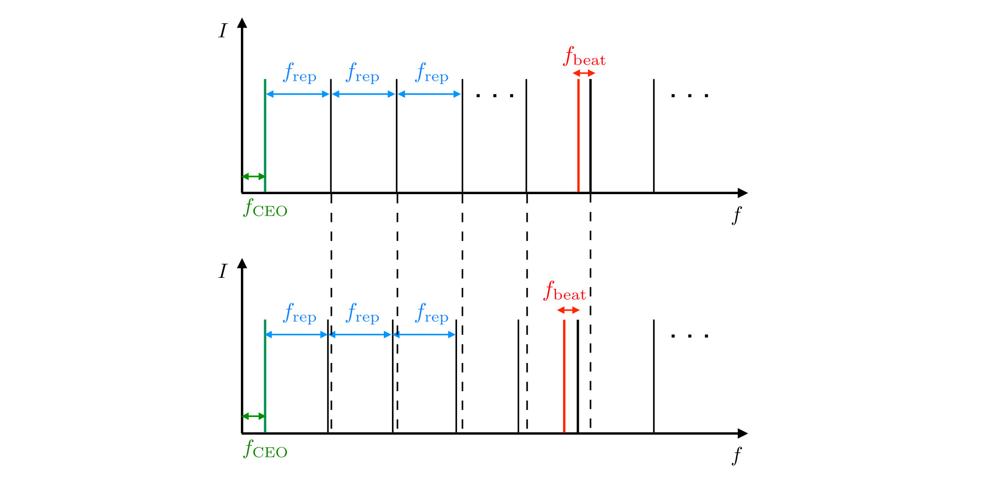

```{css css-format, echo=FALSE}
.header-section-number { display: none; }
body { counter-reset: counter-level-1; }
h1:not(.title) {
  counter-increment: counter-level-1;
  counter-reset: counter-level-2;
}
h1:not(.title)::before{ content: "Task " counter(counter-level-1) ": "; }
h2 {
  counter-increment: counter-level-2;
  counter-reset: counter-level-3;
}
h2::before { content: counter(counter-level-1) "." counter(counter-level-2) " "; }
```

```{cat abb-tab-eq, engine.opts = list(file = "_bookdown.yml")}
language:
  label:
    fig: 'Figure '
    tab: 'Table '
    eq: 'Equation '
```

```{r Initialisierung, include=F, message=F, warning=F}
rm(list=ls()) # Loeschen aller Variablen und Funktionen
options(digits=12)
```

This exercise concerns the use of frequency combs for accurate frequency calibration in the context of precision spectroscopic measurements. The exercise is structured as follows: the first part refers to the general principle of locking a continuous-wave (cw) laser to a frequency comb, and how a beat-note signal between them can be observed and used for accurate frequency calibration. The second part is related to using the frequency comb in order to scan the frequency of the cw laser. We see how we can use this procedure to obtain a frequency-comb-calibrated, first-order-Doppler-compensated spectrum of a transition to a high Rydberg state in H$_2$, from which we can obtain accurate values for ionization energies in this fundamental system.

#  {#Aufg1}
Frequency measurement methods based on the determination of wavelengths from interferometry (wavelength measurements) do not offer the accuracy required by precision spectroscopic determinations nowadays. Instead, a direct measurement (counting) of the frequency is desired. Whereas typical laser frequencies (e.g., $5\times10^{14}$ Hz, corresponding to a wavelength of 600 nm) cannot be counted by electronic circuits, a frequency comb can be used in order to obtain a countable, low-frequency beat-note signal with the laser, from which an accurate value of the laser frequency ($f_{\textrm{laser}}$) can be calculated.

The frequency comb is a mode-locked femtosecond laser which emits a series of ultrashort pulses spanning a rather broad frequency range. The frequency of the $n^{\textrm{th}}$ comb tooth is given by
\begin{equation}
f_n = f_{\textrm{CEO}} + n \cdot f_{\textrm{rep}}, (\#eq:ntooth)
\end{equation}
where $f_{\textrm{CEO}}$ is the frequency of the carrier-envelope-offset and $f_{\textrm{rep}}$ is the repetition frequency. A low-frequency beat-note signal between $f_{\textrm{laser}}$ and the closest comb tooth is obtained from analyzing the interference pattern on a photodetector. $f_{\textrm{laser}}$ is then given by 
\begin{equation}
f_{\textrm{laser}} = n \cdot f_{\textrm{rep}} + f_{\textrm{CEO}} + f_{\textrm{beat}}, (\#eq:flaser)
\end{equation}
where $f_{\textrm{beat}}$ is the frequency of the beat-note signal. 

```{r  label = fig1, echo = F, fig.cap = "Frequency output of the comb and illustration of low-frequency beat-note with $f_{\\textrm{laser}}$.", out.width = '100%'}

```

$f_\textrm{CEO}$ and $f_{\textrm{rep}}$ in Eq. \@ref(eq:flaser) can be positive or negative frequencies and the signs are determined experimentally. If a wavemeter with absolute accuracy better than $f_{\textrm{rep}}$/2 is available, the closest comb tooth $n$ can be unambiguously identified starting from the wavemeter reading and $f_{\textrm{rep}}$.

## {#A1a}
Given a wavemeter-frequency reading of 12000 cm$^{-1}$ (accurate to better than 120 MHz), $f_{\textrm{rep}} = 250$ MHz, $f_{\textrm{beat}} = -60$ MHz, and $f_\textrm{CEO} = -20$ MHz, find $n$ in Eq. \@ref(eq:flaser).

```{r}

```

## {#A1b}
The output of the frequency comb is now frequency-upconverted in a nonlinear process, called sum-frequency mixing. The resulting frequencies from this process are 
\begin{align}
f' = f_n \pm f_{n'}, (\#eq:fn-doub-00)
\end{align}
where $f_n$ and $f_{n'}$ are the frequencies of any two comb teeth. How does the comb output after this nonlinear process change, compared to the structure in Fig. \@ref(fig:fig1)? 

*Hint*: You can start by considering what the result of sum-frequency mixing of $f_{n'}$ = $f_n$ and $f_{n'}$ = $f_{n+1}$ is, using Eq. \@ref(eq:ntooth).

```{r}

```

## {#A1c}
Fig. \@ref(fig:fig2)a) shows the signal (in the time-domain) received by the counter, corresponding to a low-frequency beat-note signal. Visually estimate, based on this signal, what beat frequency it corresponds to.

```{r fig2, eval=T, include=T, echo=T, fig.width = 16.5/2.54, fig.height=16/2.54, fig.fullwidth = F, fig.cap = "Time-domain beat-note signals over 1 $\\mu$s: non-corrected (a) and corrected (b) traces.", out.width = '100%', warning=F, message=F, cache=F, fig.align='center'}
# -----------------------------------------------------------------
# Plot-Parameter:
# -----------------------------------------------------------------
layout(matrix(c(1:2), 2, 1, byrow = TRUE), 
    widths=c(1), heights=c(1,1))
par(new=F, mai=c(1,1,0,1)+0.05, omi=c(0,0,0,0),
    xaxs='i', yaxs='r', las=1, cex=1, cex.lab=1, cex.axis=1)
# -----------------------------------------------------------------

# Read in real time signal
data00 <- read.csv('trace_00.csv', header = TRUE)
x_data <- data00$time_ns
y_data <- data00$signal

par(mfrow = c(2, 1))  # Create a 2x1 layout for plots

plot(x_data, y_data, xlim=c(-580,580), type='l', xlab = 'time / ns', ylab = 'signal / mV')
grid()
abline(h=0, col='blue', lwd=1.5)
abline(v = c(0, 100, 200), col='red', lty=2, lwd=2)
text(x = 540, y = 410, labels = "a)", col = "black", cex = 1.5)

# Read in corrected time signal
data01 <- read.csv('trace_01.csv', header = TRUE)
x_data_1 <- data01$time_ns
y_data_1 <- data01$signal

plot(x_data_1, y_data_1, xlim=c(-580,580), type='l', xlab = 'time / ns', ylab = 'signal / mV')
grid()
abline(h=0, col='blue', lwd=1.5)
abline(v = c(0, 100, 200), col='red', lty=2, lwd=2)
text(x = 540, y = 500, labels = "b)", col = "black", cex = 1.5)
```

In Fig. \@ref(fig:fig2)a), the intensity shows some modulations caused by short-term instabilities of the laser intensity. If at any point the signal gets too weak, one zero-crossing could be missed by the counter. In order to avoid this, a resonator which is phase-locked to the non-corrected signal (Fig. \@ref(fig:fig2)a)) can be used. Fig. \@ref(fig:fig2)b) shows the resulting corrected signal, in which the oscillations have a constant amplitude. 

Can you retrieve the frequency domain spectra corresponding to the two time traces, and identify how and why they differ? How does the frequency of the lowest-beat-note signal compare to the one you visually estimated? What other frequencies can you see in the spectrum of the corrected signal and can you assign them?

```{r}

```

# {#Aufg2}
The locking scheme described above can also be used to change the frequency $f_{\textrm{laser}}$. The way this is achieved is by changing $f_{\textrm{rep}}$, while $f_{\textrm{beat}}$ is kept constant using a control mechanism (see Fig. \@ref(fig:fig3)). It follows from Eq. \@ref(eq:flaser) that $f_{\textrm{laser}}$ then has to also change by an amount proportional to the change in $f_{\textrm{rep}}$ ($\delta_{f_{\textrm{rep}}}$):
\begin{align}
\delta_{f_{\textrm{laser}}} = n \cdot \delta_{f_{\textrm{rep}}}. (\#eq:scan-fr)
\end{align}

```{r  label = fig3, echo = F, fig.cap = "Schematic representation of the scanning procedure of $f_{\\textrm{laser}}$ using the lock to the frequency comb.", out.width = '100%'}

```

Transitions to high-lying Rydberg states in H$_2$ can be measured in multiphoton excitation schemes starting from the ground molecular states. In the next part of the exercise, we will focus on the last step of this multiphoton excitation, which in this case is the transition from an electronically excited state, called GK($v=2, N=2$), to a high-lying Rydberg state of $n=70$, converging to the H$_2^+(v^+=1, N^+=0)$ ionic state. This is depicted schematically in Fig. \@ref(fig:fig4). The numbers in brackets represent the vibrational ($v, v^+$) and rotational ($N, N^+$) quantum numbers of the states.

```{r  label = fig4, echo = F, fig.cap = "Schematic representation of the $n=70$ ($v^+=1, N=0$) $\\leftarrow$ GK ($v=2, N=2$) transition in para-H$_2$ in relation to the ionization limit.", out.width = '100%'}

```

## {#A2a}
What would the step size $\delta_{f_{\textrm{rep}}}$ required to scan the frequency of the laser in steps of 500 kHz, for a laser frequency of 12000 cm$^{-1}$? 

```{r}

```

## {#A2b}
The result of such a scan is shown in Fig. \@ref(fig:fig5), where the first-order Doppler shift has been compensated for by retroreflecting the incoming laser beam on a mirror situated beyond the excitation region (see \"{U}bung 4 for details), which led to two observed lines with opposite first-order Doppler shifts. What is the frequency of this transition?

```{r  label = fig5, echo = F, fig.cap = "Spectrum of $n$=70 ($v^+=1, N=0$) $\\leftarrow$ GK ($v=2, N=2$) transition in para-H$_2$.", out.width = '100%'}
# Read in wavemeter and comb frequencies, beat frequency and signal

data02 <- read.csv('spectrum_GK22_70f03_h2.csv', header = TRUE)
freq_comb <- data02$comb_freq2
signal<- data02$signal

freq_comb_mat=matrix(freq_comb,ncol=3,byrow=T)
signal_mat=matrix(signal,ncol=3,byrow=T)

plot(rowMeans(freq_comb_mat) - 13115.65, rowMeans(signal_mat), type = 'l', lwd=2, xlab =  expression("wavenumber /" ~ cm^{-1} ~ " - 13115.65"), ylab = 'ion signal / a.u.')
grid()
```

```{r}

```

## {#A2c}
If the quantum defect $\mu$ of the $n=70$ state measured above is $6.92\times10^{-3}$, can you find out the ionization energy of the GK($v=2, N=2$) state relative to the H$_2^+ (v^+=1, N^+=0)$ ionic state, using the diagram in Fig. \@ref(fig:fig4)? The mass-corrected Rydberg constant of H$_2$ is $R_{\textrm{H}_2}$ = 109707.450 cm$^{-1}$.

```{r}

```
